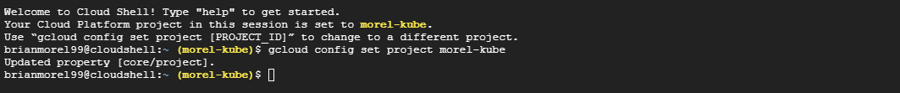

# How to Run the Voting App on Google Kubernetes Engine

### Instruction for this mainly sourced from the below page

https://cloud.google.com/kubernetes-engine/docs/deploy-app-cluster

* For any issues with the below, please reference that page.

### First Steps

1. In the Google Cloud console, on the project selector page, select or create a Google Cloud project.
2. Go to project selector
3. Make sure that billing is enabled for your Google Cloud project.
4. Enable the Artifact Registry and Google Kubernetes Engine APIs.
5. Go to the Google Cloud console.

### From the Cloud Console
1. Set Project ID

```
gcloud config set project PROJECT_ID
```

Replace PROJECT_ID with your project ID.



2. Create cluster

```
gcloud container clusters create-auto voting-app --location=us-central1
```


2. Get the configuration for kubectl and credentials to access cluster

```
gcloud container clusters get-credentials voting-app --location us-central1
```


3. Clone the git repository with the voting-app project

```
git clone https://github.com/brianmorel99/voting-app-bjm.git
```


4. Change into the project directory

```
cd voting-app-bjm
```


5. Deploy the app to the cluster

```
 kubectl create -f k8s-specifications/
```


6. It may take some time to deploy and start the containers.  Run the below command until you see the "External IP" display for both the vote and result container.

```
kubectl get services
```


### In a Web Browser

1. Open a new tab or window and navigate to the IP address of the vote app

```
http://IP_VOTE_APP
```


2. Open a new tab or window and navigate to the IP address of the result app

```
http://IP_RESULT_APP
```


* Any issues, make sure you are using http and not https

3. If both pages are displaying as expected, return to Cloud Shell

### Back in Cloud Shell

1. Install a package to help run the seed data

```
sudo apt install apache2-utils
```


2. Change into the seed-data directory

```
cd seed-data
```

2. Run the below command, and type in the Vote IP address when prompted

```
./generate-votes.sh
```


3. Go back to the Results page to see the updated vote totals.


4. Go to the Vote page and vote for a team.


5. Go to the results page and see updated vote totals.


# Cleanup

### Back in Cloud Shell

1. Change to the main app directory

```
cd ..
```

2. Remove the pods for the application

```
kubectl delete -f k8s-specifications/
```


3. Shutdown the kubernetes cluster.

```
gloud container clusters delete voting-app --location us-central1
```


4. It would be a good idea to remove the project as well, just in case there is still anything running.